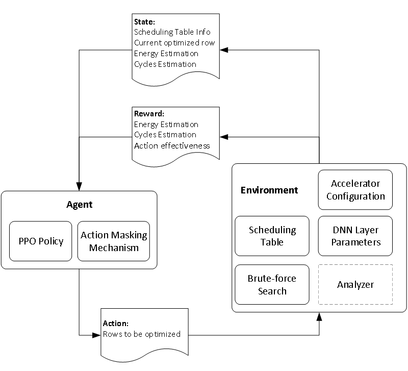

# Reinforcement Learning-Based Scheduling Optimization for DNN Accelerators

## Overview
This project implements a novel **Reinforcement Learning (RL)-based framework** for optimizing dataflow scheduling in Deep Neural Network (DNN) accelerators. It focuses on improving the **execution cycles** and **energy consumption** of hardware accelerators through dynamic scheduling strategies.

## Method
### Problem Definition
This project uses a **scheduling table** to represent the mapping relationships between DNN layer parameters and accelerator components. The goal is to optimize these mappings to meet both DNN and hardware constraints.

### Reinforcement Learning Framework
The RL framework consists of two primary components:
- **Agent**: Uses **Proximal Policy Optimization (PPO)** to optimize the policy based on the current state of the system.
- **Environment**: Simulates the hardware configuration and DNN layer parameters, providing feedback on energy consumption and execution time after each action.


The framework also defines the state space, action space, reward function, and the policy.
- The **state space** includes the current state of the scheduling table, the available component for the next optimization step, the energy consumption and execution cycles of the current scheduling table.
- The **action space** refers to selecting which rows of the scheduling table to optimize.
- The **reward function** is defined based on energy consumption, execution cycles, and the effectiveness of the action taken. 

To effectively optimize the scheduling strategy within the reinforcement learning framework, we employ the PPO method. 
- The actor loss is using a clipped surrogate objective.
- The critic loss integrates the L2 norm penalty with the Smooth L1 loss (Huber loss) to prevent overfitting while ensuring stable training.
- The total loss incorporates entropy regularization, with decaying entropy coefficient, thereby improving long-term performance.

### Action Masking Mechanism
To improve the efficiency of the reinforcement learning algorithm, we introduce an **action masking mechanism**, which is performed by applying a binary mask to each action. 

When an action is invalid in the current state, the mask value is set to 0, indicating that the action is masked; when the action is valid, the mask value is set to 1, indicating that the agent can choose that action.

### Brute-force Search for Local Optimization
A brute-force search is employed to find locally optimal solutions for the rows selected by the RL agent.


## Results
We validated the framework on various DNN models, including **YOLO v3**, **Inception v4**, **MobileNet v3**, and **ResNet-50**, across multiple accelerators like **Eyeriss**, **TPU v3**, and **Simba**. The experimental results show substantial improvements, with RL-Scheduling achieving up to a **65.6%** reduction in execution cycles and a **59.7%** improvement in energy efficiency over existing scheduling algorithms. Additionally, the method demonstrates superior algorithm execution efficiency compared to most existing approaches.

Future work will focus on improving scalability by refining the state space representation and extending the framework to more complex DNN tasks.

## Setup

### Dependencies
- build-essential
- g++
- make
- libgomp1
- python3
- python3-dev
- pybind11-dev
- torch
- numpy
- matplotlib
- pybind11
- setuptools

### Installation
1. Clone the repository:
   ```bash
   git clone https://github.com/yourusername/rl-dnn-accelerator-scheduling.git
   ```
2. Install dependencies:
- You can either install the required packages manually or build the Docker image:
   ```bash
   docker build -f ./dockerfile.mirror -t rl-scheduling:cuda .
   ```
3. Run the docker image:
- Use the following command to run the Docker image:
   ```bash
   docker run -it --rm --gpus all -v xx:/app  rl-scheduling:cuda
   ```
4. Build the code:
- Execute the build script:
   ```bash
   ./build.sh
   ```
5. Run the application:
- You can run the code with 3 modes:
   ```bash
   python3 src/python_app/run.py [train|test|run <accelerator_path> <network_path> <layer_idx>]
   ```